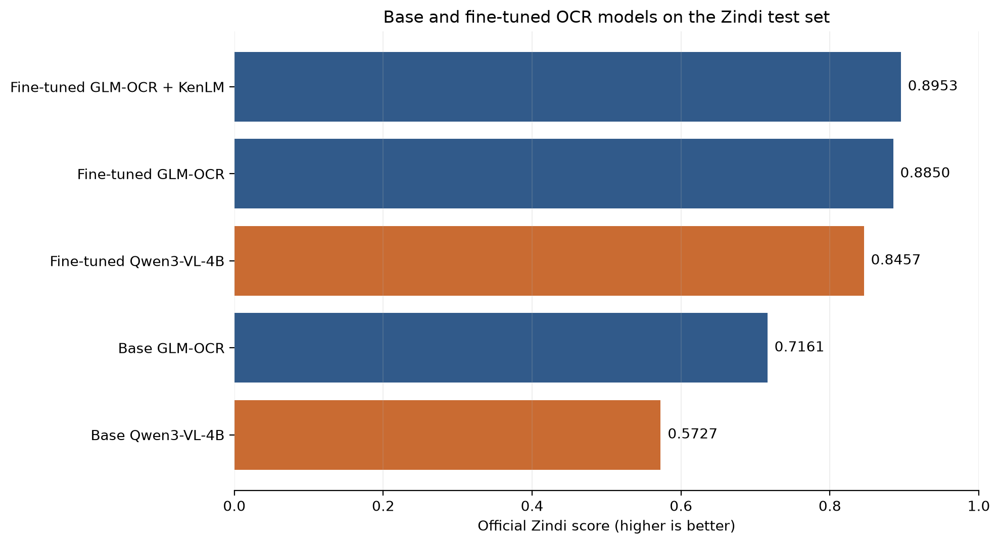
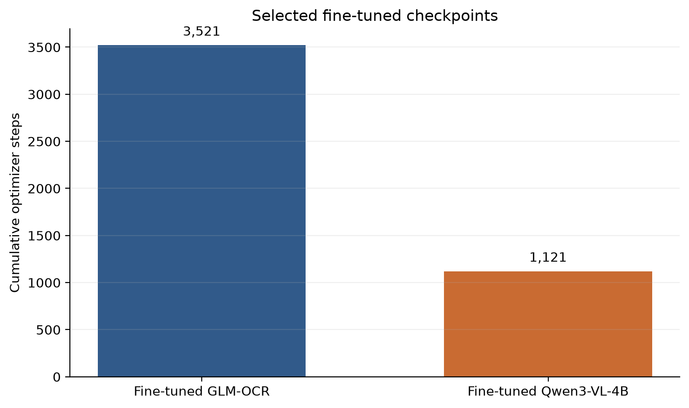

# GLM-OCR and Qwen3-VL for Historical Handwriting Recognition

Fine-tuning, decoding, and inference experiments for the [R.O.A.D. Barbados Historic Handwriting Challenge](https://zindi.world/competitions/road-barbados-historic-handwriting-challenge). The final comparison covers base and fine-tuned GLM-OCR, GLM-OCR with character-level KenLM shallow fusion, and base and fine-tuned Qwen3-VL-4B-Instruct.

This repository publishes code and aggregate result figures only. Competition images, labels, submissions, downloaded model weights, adapters, and cached predictions are deliberately excluded.

## Compared systems

| System | Selected checkpoint | Neural training | Decoder |
|---|---|---:|---|
| Base GLM-OCR | `zai-org/GLM-OCR` | 0 steps / 0 epochs | Greedy |
| Fine-tuned GLM-OCR | Stage 2 checkpoint 642 | 3,521 cumulative steps / 1.5005 cumulative epochs | Greedy |
| Fine-tuned GLM-OCR + KenLM | Stage 2 checkpoint 642 | 3,521 cumulative steps / 1.5005 cumulative epochs | Beam 4 + character 6-gram, lambda 0.10 |
| Base Qwen3-VL-4B | `Qwen/Qwen3-VL-4B-Instruct` | 0 steps / 0 epochs | Greedy |
| Fine-tuned Qwen3-VL-4B | Stage 2 checkpoint 257 | 1,121 cumulative steps / 0.9509 cumulative epochs | Greedy |

The Qwen checkpoint is the latest completed and evaluated Stage 2 checkpoint. The later training process was interrupted, so it is intentionally treated as the selected available checkpoint rather than as a completed Stage 2 run.

The controlled final comparison used the competition test set through five separate Zindi submissions produced by `notebooks/final_test_benchmark.ipynb`. Test labels are not public, so each official score was returned by Zindi after its corresponding submission was uploaded.

## Final Zindi benchmark

| System | Official score | Gain over family base |
|---|---:|---:|
| Base GLM-OCR | 0.716085382 | — |
| Fine-tuned GLM-OCR | 0.885003890 | +0.168918508 |
| Fine-tuned GLM-OCR + KenLM | **0.895312889** | **+0.179227507** |
| Base Qwen3-VL-4B | 0.572675155 | — |
| Fine-tuned Qwen3-VL-4B | 0.845694646 | +0.273019491 |

The strongest submitted system was fine-tuned GLM-OCR with character-level KenLM shallow fusion. Fine-tuning improved both model families substantially; the Qwen model had the larger within-family gain, while the fine-tuned GLM systems achieved the highest absolute scores.



The training-step comparison reports cumulative optimizer steps for the selected fine-tuned checkpoints. It is run metadata rather than a compute-normalized efficiency comparison because the two architectures and training recipes differ.



## Development evidence

The following results describe GLM development experiments. They were produced on local development subsets and are not the final GLM-versus-Qwen comparison.

| Experiment | Evaluation scope | Local proxy | Gain |
|---|---:|---:|---:|
| Checkpoint 642, greedy at 1536 visual tokens | 400 images | 0.888709 | — |
| 2048 tokens only for capped crops | 400-image hybrid | 0.890397 | +0.001687 |
| Beam 4 baseline | 300-image KenLM evaluation split | 0.891962 | — |
| Beam 4 + character KenLM, lambda 0.10 | Same 300 images | 0.899150 | +0.007189 |

The separate Stage 2-from-best-Stage-1 GLM run selected checkpoint 770 at epoch 0.30 with a 0.884229 proxy. It used a different selection history and is not directly comparable to checkpoint 642. The Qwen curriculum used a different development split, so its local validation score must not be compared directly with the GLM development scores above.

## Repository layout

```text
notebooks/
  glm_finetuning.ipynb
  qwen3_vl_4b_finetuning.ipynb
  glm_greedy_vs_beam4.ipynb
  glm_kenlm_decoding.ipynb
  glm_higher_resolution.ipynb
  base_models_benchmark.ipynb
  final_test_benchmark.ipynb
src/
  barbados_ocr_augmentation.py
  transcription_metrics.py
tests/
figures/          # aggregate benchmark figures safe for publication
resources/        # create locally; never commit competition files
model/            # download locally; never commit model weights
training_outputs/ # generated locally; never commit checkpoints, predictions, or submissions
```

Publication copies of the notebooks must have execution outputs and embedded dataset examples removed. Original working notebooks may remain in the repository root locally and are ignored by Git.

## Setup

The recorded runs used Linux, Python 3.11, CUDA, PyTorch 2.8.0+cu128, Transformers 5.8.0, PEFT 0.18.1, Albumentations 2.0.8, OpenCV 5.0.0, and NumPy 2.4.6. A CUDA GPU with bfloat16 support is recommended.

```bash
python3.11 -m venv .venv
source .venv/bin/activate
python -m pip install --upgrade pip
python -m pip install -r requirements.txt
```

Install the PyTorch build appropriate for your CUDA driver if the default wheel is unsuitable. Additional requirements are separated by task:

```bash
python -m pip install -r requirements-benchmark.txt
python -m pip install -r requirements-qwen-training.txt
python -m pip install -r requirements-kenlm.txt
```

## Private assets

Download the competition data from Zindi after accepting its terms, then arrange it locally as:

```text
resources/
  Train.csv
  Test.csv
  SampleSubmission.csv
  images/
    <ID>.jpg
```

Place the GLM-OCR base model in `model/glm-ocr/`. The Qwen notebooks resolve and pin the official `Qwen/Qwen3-VL-4B-Instruct` revision in `model/qwen3-vl-4b-instruct/`. The notebooks use local snapshots during training and inference so run identities can record exact model revisions and files.

See [DATA.md](DATA.md) for the data boundary and [MODEL_CARD.md](MODEL_CARD.md) for system scope and limitations.

## Running the experiments

Start Jupyter from the project root or one of its subdirectories. The Qwen notebook locates the project root automatically.

```bash
jupyter lab
```

The main workflow is:

1. `notebooks/glm_finetuning.ipynb`
2. `notebooks/qwen3_vl_4b_finetuning.ipynb`
3. `notebooks/glm_kenlm_decoding.ipynb` to build and select the GLM + KenLM decoder
4. `notebooks/final_test_benchmark.ipynb` to run the five selected systems on the Zindi test set

Optional development analyses are:

- `notebooks/glm_greedy_vs_beam4.ipynb`
- `notebooks/glm_higher_resolution.ipynb`
- `notebooks/base_models_benchmark.ipynb`

The base-model notebook compares untouched GLM-OCR, Qwen3-VL-4B-Instruct, and Qwen2.5-VL-7B-Instruct on the saved GLM development split. The 7B model is a development baseline and is not part of the five-system final benchmark.

All long inference loops cache each completed prediction. Models are loaded sequentially so only one neural model occupies GPU memory. The final benchmark writes:

```text
training_outputs/final_test_benchmark/
  benchmark.csv
  benchmark_models.csv
  benchmark_results.csv
  predictions_base_glm.csv
  predictions_finetuned_glm.csv
  predictions_finetuned_glm_kenlm.csv
  predictions_base_qwen.csv
  predictions_finetuned_qwen.csv
  submission_base_glm.csv
  submission_finetuned_glm.csv
  submission_finetuned_glm_kenlm.csv
  submission_base_qwen.csv
  submission_finetuned_qwen.csv
```

`benchmark.csv` is a long-form local record containing every model prediction and its training metadata. Each `predictions_*.csv` file preserves one variant's detailed predictions, while each `submission_*.csv` contains only `ID,Target`. The manually supplied official Zindi scores are combined with model metadata in `benchmark_results.csv`.

## Lightweight verification

Repository checks do not train or load either OCR model:

```bash
python -m pip install -r requirements-dev.txt
pytest
python scripts/check_public_notebooks.py
```

## Licensing and attribution

Project code is released under the [MIT License](LICENSE). The license does not grant rights to the Zindi competition data, generated transcriptions derived from that data, downloaded models, adapters, or third-party software.

GLM-OCR, Qwen3-VL, KenLM, and every other dependency retain their own upstream licenses and terms. Review the applicable upstream model and software licenses before redistributing weights or adapters.

## Responsible publication

Before any push, inspect `git status` and confirm that no dataset rows, manuscript images, checkpoints, predictions, submissions, credentials, or notebook outputs are staged. If such a file was ever committed, adding it to `.gitignore` is not sufficient; remove it from Git history before publishing.
